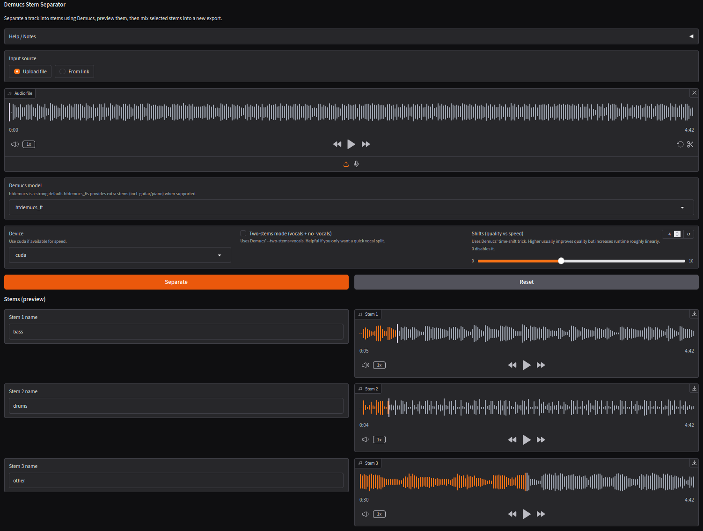

# Audio Stem Separator (Gradio)

A small [Gradio web app](https://www.gradio.app/) to:

- separate an audio track into stems using [Demucs](https://github.com/adefossez/demucs)
- use tracks from your drive or fetch them from a URL
- preview stems in the browser
- show spectrogram
- mix selected stems and export (wav/mp3)
- optionally change tempo and/or pitch (requires ffmpeg `rubberband`)

## Screenshot



## Requirements

- Python 3.12+ (3.13 works)
- [ffmpeg](https://www.ffmpeg.org/) on `PATH`
- (optional) ffmpeg built with [`rubberband` filter](https://ffmpeg.org/ffmpeg-filters.html#rubberband) for tempo/pitch controls
- GPU recommended (CUDA) to fast results, but CPU works too

## Install

Create and activate a Python virtual enviroment, then run:

```bash
git clone 
python -m pip install .
```

For ffmpeg, check [the install instructions](https://www.ffmpeg.org/download.html).

## Starting

Once the environment is set up, run:

```bash
gradio app.py
```

## Development

Developed with ChatGPT 5.2.
